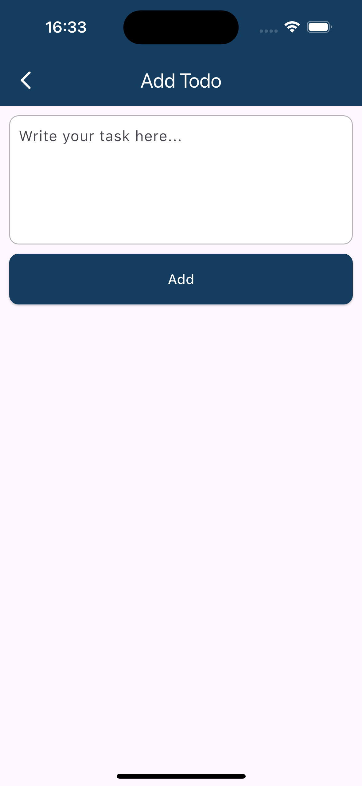

# TODO App

A simple TODO app built with Flutter to help users manage their daily tasks efficiently.

## Getting Started

## Screenshots

### Home Screen


### Add Task



### Edit Task


## Features

✅ Add new tasks✅ Edit existing tasks✅ Delete completed tasks✅ Mark tasks as completed✅ Persistent
storage using SharedPreferences or Firebase

## Getting Started

This project is a starting point for a Flutter application.

Prerequisites

Make sure you have Flutter installed. If not, follow the Flutter installation guide.

Installation

Clone the repository:

```bash
git clone https://github.com/gmulonga/TODO-app.git
```

```bash
flutter pub get
flutter run
```
